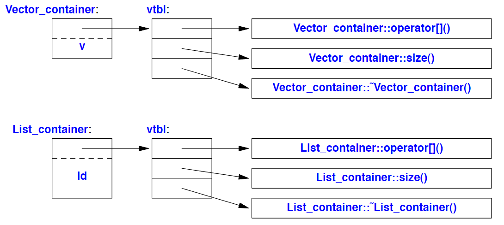

# CLASSES 

A class is a user-defined type provided to represent a concept in the code of a program.\
we  will  just  consider  the  basic  support  for  three  important  kinds  of
classes:\
+ Concrete classes
+ Abstract classes 
+ Classes in class hierarchies  

## CONCRETE TYPES

The  basic  idea  of concrete  classes is  that  they behave  "just  like built-in  types".The defining characteristic of a concrete type is that it's representation is part of it's definition. \
That allows implementations to be optimally efficient in time and space.\ 
In particular, it allows us to:\
+ Place  objects  of  concrete  types  on  the  stack,  in  statically  allocated  memory, and  in  other objects.
+ Refer to objects directly (and not just through pointers or references).
+ Initialize objects immediately and completely (e.g., using constructors).
+ Copy objects.

The representation can be private and accessible only through the member  functions,  but  it  is  present.\ 
Therefore,  if  the  representation  changes  in  any significant  way, a user must recompile. This is the price to pay for having concrete types behave exactly like built-in.
\
To  increase  flexibility, a concrete  type  can  keep major parts of its representation on the free store (dynamic memory, heap) and access them through the part stored in the class object itself. That’s the way vector and string are implemented.
\
The "classical user-defined arithmetic type" is **complex**:

        class complex
        {
            double re, im; // representation: two doubles

            public:
            
            complex(double r, double i) :re{r}, im{i} {} // construct complex from two scalars
            complex(double r) :re{r}, im{0} {} // construct complex from one scalar
            complex() :re{0}, im{0} {} // default complex: {0,0}

            double real() const { return re; }
            void real(double d) { re=d; }
            double imag() const { return im; }
            void imag(double d) { im=d; }

            complex& operator+=(complex z) { re+=z.re , im+=z.im; return ∗this; } // add to re and im and return the result
            complex& operator−=(complex z) { re−=z.re , im −=z.im; return ∗this; }
            complex& operator∗=(complex); // defined out-of-class somewhere
            complex& operator/=(complex); // defined out-of-class somewhere
        };´

A constructor  that  can  be  invoked without  an  argument  is  called  a ***default  constructor***. Thus,
complex() is complex's  default constructor. By defining a default constructor you eliminate the possibility of uninitialized variables of that type.\
The const specifiers  on  the  functions  returning  the  real  and  imaginary  parts  indicate  that  these
functions do **not modify the object for which they are called**.

Curious: The definitions of == and != are straightforward:

    bool operator==(complex a, complex b) // equal
        {
            return a.real()==b.real() && a.imag()==b.imag();
        }
    bool operator!=(complex a, complex b) // not equal
        {
            return !(a==b);
        }
        complex sqr t(complex);
        // ...
The  compiler  converts  operators  involving complex numbers  into  appropriate  function  calls. For
example, ``c!=b``  means ``operator!=(c,b)`` and ``1/a`` means ``operator/(complex{1},a)``.

## A CONTAINER

A container is an object holding a collection of elements, so we call Vector a container because it is
the type of objects that are containers. \
In some environments  you  can't use  a  collector, and  sometimes  you  prefer  more  precise  control  of  destruction for  logical  or  performance  reasons. \
We  need  a  mechanism  to  ensure  that  the  memory allocated by the constructor is deallocated; that mechanism is a *destructor*:

    class Vector {
    
        private:
            double∗ elem;   //elem points to an array of sz doubles
            int sz;

        public:
            
            Vector(int s) :elem{new double[s]}, sz{s} // constructor: acquire resources
            {
                for (int i=0; i!=s; ++i) elem[i]=0; // initialize elements
            }
            
            ~Vector() { delete[] elem; } // destructor: release resources
            
            double& operator;
            int size() const;
    };

The name of a destructor is the complement operator,  ̃~ followed by the name of the class; it's the
complement  of  a  constructor. Vector's  constructor  allocates  some  memory  on  the  free  store(also
called the heap or dynamic store) using the ``new`` operator. The destructor cleans up by freeing that
memory  using  the ``delete`` operator. This  is  all  done  without  intervention  by  users  of ``Vector``.

### INITIALIZING CONTAINERS   

A container exists to hold elements, so obviously we need convenient ways of getting elements into
a container. We can  handle  that  by  creating  a ``Vector`` with  an  appropriate  number  of  elements  and
then  assigning  to  them,  but  typically  other  ways  are  more  elegant. Let see two:

+ *Initializer-list constructor*: Initialize with a list of elements.
+ ``push_back()``: Add a new element at the end (at the back of) the sequence.
  
These can be declared like this:

        class Vector {
            public:
                Vector(std::initializ er_list<double>); // initialize with a list
                // ...
                void push_back(double); // add element at end increasing the size by one
                // ...
        }

The ``push_back()`` is useful for input of arbitrary numbers of elements.

        Vector read(istream& is)
        {
            Vector v;
            
            for (double d; is>>d;) // read floating-point values into d
            v.push_back(d); // add d to v
            
            return v;
        }

The ``std::initializer_list`` used  to  define  the  initializer-list  constructor  is  a  standard-library  type
known to the compiler: when we use a {}-list, such as {1,2,3,4}, the compiler will create an object of type initializer_list to give to the program. So, we can write:

        Vector v1 = {1,2,3,4,5}; // v1 has 5 elements
        Vector v2 = {1.23, 3.45, 6.7, 8}; // v2 has 4 elements
        
Vector's initializer-list constructor might be defined like this:
        
        Vector::Vector(std::initializer_list<double> lst):elem{new double[lst.siz e()]}, sz{lst.siz e()}
        {
            copy(lst.begin(),lst.end(),elem); // copy from lst into elem
        }

## ABSTRACT TYPES

An abstract type is a type that completely  insulates  a  user  from  implementation  details. To  do that,  we  decouple  the  interface from the representation and give  up genuine local variables.  Since we don’t know anything about the representation of an abstract type (not even it's size), we must allocate objects on the free store and access them through references or pointers. 

**Example:** We define the interface of a class ``Container`` which we will design as a more abstract ver-
sion of our ``Vector``:

        class Container {
            public:
                virtual double& operator = 0; // pure virtual function
                virtual int size() const = 0; // const member function (§3.2.1.1)
                virtual  ̃Container() {} // destructor (§3.2.1.2)
        };

This class is a pure interface to specific containers defined later. The word virtual means "may be
redefined  later  in  a  class  derived from  this  one". \
Unsurprisingly, a function  declared virtual is called a *virtual function*.\
A class derived from ``Container`` provides an implementation for the ``Container interface``.\

The curious =0 syntax says the function is *pure virtual*; that is, some class derived from ``Container`` ***must define  the  function***. Thus,  it  is  not  possible  to  define  an  object  that  is  just  a
``Container``; a ``Container`` can only serve as the interface to a class that implements it's ``operator`` and ``size()`` functions.  A class with a pure virtual function is called an *abstract class*.

> El **polimorfismo** es la propiedad de las clases de implementar -con sutiles diferencias- la interfáz de una o mas clase/s madre/s.

As is common for abstract classes, `Container` does not have a constructor. After all, it does not
have any data to initialize. On the other hand, `Container` does have a destructor and that destructor
is virtual. \
Again, that is common for abstract classes because they tend to be manipulated through references  or  pointers,  and  someone  destroying  a `Container` through  a  pointer  has  no  idea  what
resources are owned by it's implementation.\

A container that implements the functions required by the interface defined by the abstract class
`Container` could use the concrete class `Vector`:

        class Vector_container : public Container { // Vector_container implements Container
            Vector v;

            public:
                Vector_container(int s) : v(s) { } // Vector of s elements
                ̃Vector_container() {}
                double& operator { return v[i]; }
                int size() const { return v.siz e(); }
        };

The members `operator` and `size()` are said to override the corresponding members in the base
class `Container`. The destructor, `~Vector_container()` overrides  the  base  class  destructor `Container()`. Note that  the  member  destructor `Vector()` is implicitly  invoked by it's  class's destructor.\

For a  function like `use(Container&)` to use a `Container` in complete ignorance of implementation
details, some other function will have to make an object on which it can operate.\
For example:

        void use(Container& c)
        {
            const int sz = c.size();
            for (int i=0; i!=sz; ++i)
            cout << c[i] << '\n';
        }

        void g()
        {
            Vector_container vc {10, 9, 8, 7, 6, 5, 4, 3, 2, 1, 0};
            use(vc);
        }
        
Since `use()` doesn't know about `Vector_container's` but  only  knows  the `Container` interface,  it  will
work just as well for a different implementation of a ``Container``.

## VIRTUAL FUNCTIONS

How is the call `c[i]` in `use()` resolved to the right operator??\

A `Container` object  must  contain  information  to  allow it to select  the  right
function to call at run time. The usual implementation technique is for the compiler to *convert the
name of a virtual function into an index into a table of pointers to function*. \
That table is usually called the *virtual function table* or simply the **vtbl**. Each class with virtual functions has its own **vtbl** identifying it's virtual functions.\
This can be represented graphically like this:

The  implementation  of  the  caller  needs  only  to know the location of the pointer to the **vtbl** in a `Container` and the index used for each virtual function. This virtual  call  mechanism  can  be  made  almost  as  efficient  as  the "normal  function  call" mechanism  (within  25%). It's  space  overhead  is  one  pointer  in  each  object  of  a  class  with  virtual
functions plus one **vtbl** for each such class.

## CLASS HIERARCHIES 
